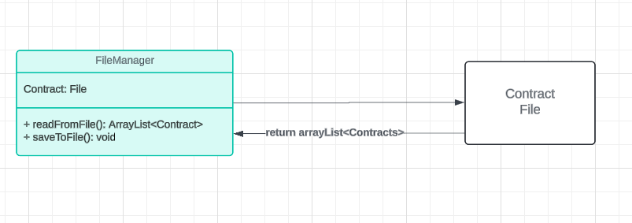

# car-dealer-ship
### Overview of project
I made a car dealer ship project for a car sales man. This project will include a dealer ship and vehicles. The project will allow the user to add, remove, and search for cars in the inventory. 

UML for project:


## Phase 1

I started by working on the Dealership class and my vehicle class. In my Dealer ship class i added get all vehicles functionaly, add or remove vehicles from the inventory. I added test cases for get all vehicles and add a vehicle.

## Phase 2

I added the functionalty that will allow the program to read all the data in the csv file when the application runs. I also made the application save the data that was added, or removed to the from memorey to the csv file when the application gets closed.

## Phase 3

I added the application user interface to allow the user to interacte with the application. I made the menu with all the list options for the user. 

## Phase 4

I added functionalty to the user interface dispatching commands to the application's backend allowing the user to interact with the data in the csv file. 

## List menu

1) List All vehicles

When the user enters "1" it will dispatch that command to the backend and load all the vehicles from the dealer ship class to the userInterface class, from the user interface class the vehicles get displayed on the screen.

2) Add a vehicle

When the user enters "2". The user will be prompted for the vehicle information. Once the user provides the nessary information about the vehicle it will be added to the dealer ships inventory. 

3) Remove a vehicle

When the user enters "3". The user will be prompted for the vin number for the vehicle they want to remove. Then it will search for the vehicle with the same exact vin number and remove it from the inventory.

4) Find vehicles within a price range

 Once the user enters "4". The user will be prompted for the minimum and maximum price range. Once the user provides that information. The program will search throught the dealer ship inventory and check if the vehicle is within that price range. Then it will get displayed on to the screen.

5) Find vehicles by make / model

When the user enters "5". The user will be prompted for the make and model of the vehicle. After the user provides the make and model. The program will search for that vehicle with the make and model name. Then it will display all the vehicles that match that name on to the screen.

6) Find vehicles by year range

When the user enters "6". The application will prompt the user for start year and end year. Once the user provides that information it will search in the data base and check if the inventory has a car equal to or between that year range. Then it will be displayed to the screen. 

7) Find vehicles by color

When the user enters "7". The application will prompt the for vehicle color. Then it will search in the car dealership inventory for the vehicle with color provided. It will then display it on to the screen.

8) Find vehicles by mileage range

Once the user enters "8". The application will prompt the user for starting mileage and ending mileage range. Then the program will dispatch to the backend and search for vehicles with in that mile range. 

9) Find vehicles by type (Car, truck, SUV, van)

When the user enters "9". The application will prompt the user for vehicle type. Then it will search in dealership inventory and check if there is a vehicle with same vehicle type provided. Once it finds it will be displayed on to the screen. 

0) Save and quit

Last but not least, once the user enters "0" the application will save all the data the was removed or added to the csv file and then close the application. 

Code used to fetch and save date:
```java
public class FileManager {

    public static DealerShip getDealership()
    {
        DealerShip dealerShip = null;

        //reading file
        File inventoryFile = new File("files//inventory.csv");
        try(
                FileReader filereader = new FileReader(inventoryFile);
                Scanner reader = new Scanner(filereader)
        )
        {
            // getting dealership from first line of the file
            String firstLine = reader.nextLine();
            String[] dealerShipColumns = firstLine.split("[|]");

            String dealerShipName = dealerShipColumns[0];
            String dealerShipAddress = dealerShipColumns[1];
            String dealerShipPhone = dealerShipColumns[2];

            dealerShip = new DealerShip(dealerShipName, dealerShipAddress, dealerShipPhone);

            while(reader.hasNextLine())
            {
                // reading the rest of the lines
                String line = reader.nextLine();
                String[] vehicleColumns = line.split("[|]");

                int vin = Integer.parseInt(vehicleColumns[0].strip());
                int year = Integer.parseInt(vehicleColumns[1].strip());
                String make = vehicleColumns[2].strip();
                String model = vehicleColumns[3].strip();
                String vehicleType = vehicleColumns[4].strip();
                String color = vehicleColumns[5].strip();
                int odometer = Integer.parseInt(vehicleColumns[6].strip());
                double price = Double.parseDouble(vehicleColumns[7].strip());

                // creating a vehicle object with the data from the csv file
                Vehicle vehicle = new Vehicle(vin, year, make, model, vehicleType, color, odometer, price);

                // adding vehicle to inventory
                dealerShip.addVehicle(vehicle);
            }
        }
        catch (IOException e)
        {
            System.out.println("File does not exist");
        }
        catch (Exception e)
        {
            System.out.println("Something went wrong");
        }
        return dealerShip;
    }

    public static void saveDealerShip(DealerShip dealerShip)
    {

        File inventoryFile = new File("files/inventory.csv");

        // saving data to the csv file when the user leaves
        try(
                FileWriter fileWriter = new FileWriter(inventoryFile);
                PrintWriter writer = new PrintWriter(fileWriter)
                )
        {
            // getting the dealership name and writing it to the file
            String dealerShipName = dealerShip.getName();
            String dealerShipAddress = dealerShip.getAddress();
            String dealerShipPhone = dealerShip.getPhone();

            writer.printf(" %s | %s | %s \n", dealerShipName, dealerShipAddress, dealerShipPhone);

            ArrayList<Vehicle> inventory = dealerShip.getAllVehicles();

            // getting the vehicles in the inventory and writing it to the file
            for(Vehicle vehicle : inventory)
            {
                writer.printf(" %d | %d | %s | %s | %s | %s | %d | %.2f \n", vehicle.getVin(), vehicle.getYear(), vehicle.getMake(), vehicle.getModel(), vehicle.getVehicleType(), vehicle.getColor(), vehicle.getOdometer(), vehicle.getPrice());
            }

        }
        catch (IOException e)
        {
            System.out.println("File does not exist");
        }
        catch (Exception e)
        {
            System.out.println("Something went wrong");
        }
    }
}
```

Sample code for filtering the data with price range:

```java
public void findVehicleWithPriceRange(DealerShip dealerShip)
    {
        try
        {
            // getting min and max price
            System.out.println();
            System.out.print("Enter minimum price: ");
            double minPrice = userInput.nextDouble();
            userInput.nextLine();

            System.out.print("Enter maximum price: ");
            double maxPrice = userInput.nextDouble();
            userInput.nextLine();

            // searching within price range

            ArrayList<Vehicle> priceRangeVehicles = (ArrayList<Vehicle>) dealerShip.getAllVehicles().stream()
                    .filter(vehicle -> vehicle.getPrice() >= minPrice)
                    .filter(vehicle -> vehicle.getPrice() <= maxPrice)
                    .collect(Collectors.toList());

            System.out.println();
            System.out.println("-----------------------------------------Vehicles by price range------------------------------------");
            System.out.printf(" %-10s | %-10s | %-10s | %-10s | %-10s | %-10s | %-10s | %-10s \n", vinTitle, yearTitle, makeTitle, modelTitle, typeTitle, colorTitle, odometerTitle, priceTitle);
            System.out.println("-".repeat(100));
            for(Vehicle vehicle : priceRangeVehicles)
            {
                System.out.printf(" %-10d | %-10d | %-10s | %-10s | %-10s | %-10s | %-10d | %.2f \n", vehicle.getVin(), vehicle.getYear(), vehicle.getMake(), vehicle.getModel(), vehicle.getVehicleType(), vehicle.getColor(), vehicle.getOdometer(), vehicle.getPrice());
                System.out.println("-".repeat(100));
            }
            if(priceRangeVehicles.isEmpty())
            {
                System.out.println("No vehicles found");
            }

        }
        catch (NumberFormatException e)
        {
            System.out.println();
            System.out.println("Please enter your input in numbers");
        }
        catch (Exception e)
        {
            System.out.println();
            System.out.println("Something went wrong, try again");
        }
    }
```

## Test Cases

I added test cases for the dealerShip to check if all the search operations are working correctly.

I think this the unit test are pretty interesting because if you added code to your program and something fails you get to look at the error because of the unit tests you had.
Sample test: 

```java
    @Test
    public void getVehiclesFindVehiclesByYearRange_shouldReturn_allVehiclesWithInTheYearRange()
    {
        //arrange
        DealerShip dealerShip = FileManager.getDealership();
        int startingYear = 2015;
        int endingYear = 2020;

        //act
        ArrayList<Vehicle> vehiclesByMakeAndModel = dealerShip.getVehiclesByYearRange(startingYear, endingYear);

        //assert
        for(Vehicle vehicle : vehiclesByMakeAndModel)
        {
            assertTrue(vehicle.getYear() >= startingYear && vehicle.getYear() <= endingYear);
        }
    }
```

Example of how to use the application:


To use this application you will run it in the terminal and choose any of the list option depending on what you want to do.


## ADDED LEASE AND SALE CONTRACTS

## Contracts diagram




## Phase 1

We created those classes in the diagram, in intellij to have templates of the contract class, so we could make object off those classes as contracts either a sale or lease depeanding on what the user decides.


```java
public class Sales extends Contract
{
    private final double SALES_TAX;
    private final double RECORDING_FEE;
    private double processingFee;
    private boolean financed;

    public Sales(String date, String customerName, String customerEmail, boolean vehicleSold, double monthlyPayment, double salePrice, boolean financed)
    {
        super(date, customerName, customerEmail, vehicleSold, monthlyPayment, salePrice);
        this.SALES_TAX = salePrice * .05;
        this.RECORDING_FEE = 100;
        this.processingFee = salePrice < 10000 ? 295 : 495;
        this.financed = financed;
    }

    public double getSALES_TAX() {
        return SALES_TAX;
    }

    public double getRECORDING_FEE() {
        return RECORDING_FEE;
    }

    public double getProcessingFee() {
        return processingFee;
    }

    public void setProcessingFee(double processingFee) {
        this.processingFee = processingFee;
    }

    public boolean isFinanced() {
        return financed;
    }

    public void setFinanced(boolean financed) {
        this.financed = financed;
    }

    @Override
    public double getTotalPrice()
    {
        return getSalePrice() + getSALES_TAX() + getRECORDING_FEE() + getProcessingFee();
    }

    @Override
    public double getMonthlyPayment()
    {
        double monthlyPayment = 0;

        if(isFinanced())
        {
            if(getTotalPrice() >= 10000)
            {
                monthlyPayment = 4.25 * (getTotalPrice() / 48);
            }
            else
            {
                monthlyPayment = 5.25 * (getTotalPrice() / 24);
            }
        }
        return monthlyPayment;
    }
}
```

## Phase 2 

We created a Contract File Manager which we have an Array List where we get all the Contracts. Once we sell a vehicle, it will be printed differently in our contracts.csv file. Depending on what instance it is wether it is Sale or a Lease.  

```java
package com.pluralsight.Services;

import com.pluralsight.Model.*;

import java.io.File;
import java.io.FileWriter;
import java.io.IOException;
import java.io.PrintWriter;
import java.util.ArrayList;

public class ContractFileManager {
    public static void saveContract(DealerShip dealerShip)
    {
        // getting all the contract from the dealership
        ArrayList<Contract> contracts = dealerShip.getAllContracts();
        File file = new File("files/contracts.csv");

        // writing to file
        try(
                FileWriter fileWriter = new FileWriter(file,true);
                PrintWriter writer = new PrintWriter(fileWriter)
                )
        {
           for (Contract contract : contracts)
           {
               // getting the vehicle being sold
               Vehicle vehicle = contract.getVehicleSold();

               // checking if the contract is sale or lease
               if(contract instanceof Sales)
               {

                   // checking if the vehicle is financed
                   String isFinanced = ((Sales) contract).isFinanced() ? "Yes" : "No";
                   if(isFinanced.equalsIgnoreCase("yes")) {
                       writer.printf(" Sale | %s | %s | %s | %d | %d | %s | %s | %s | %s | %d | %.2f | %.2f | %.2f | %.2f | %.2f | %s | %.2f \n",
                               contract.getDate(), contract.getCustomerName(), contract.getCustomerEmail(), vehicle.getVin(), vehicle.getYear(), vehicle.getMake(), vehicle.getModel(), vehicle.getVehicleType(), vehicle.getColor(), vehicle.getOdometer(), vehicle.getPrice(),
                               ((Sales) contract).getSALES_TAX(), ((Sales) contract).getRECORDING_FEE(), ((Sales) contract).getProcessingFee(), contract.getTotalPrice(),
                               isFinanced, contract.getMonthlyPayment());
                   }
                   else {
                       writer.printf(" Sale | %s | %s | %s | %d | %d | %s | %s | %s | %s | %d | %.2f | %.2f | %.2f | %.2f | %.2f | %s  \n",
                               contract.getDate(), contract.getCustomerName(), contract.getCustomerEmail(), vehicle.getVin(), vehicle.getYear(), vehicle.getMake(), vehicle.getModel(), vehicle.getVehicleType(), vehicle.getColor(), vehicle.getOdometer(), vehicle.getPrice(),
                               ((Sales) contract).getSALES_TAX(), ((Sales) contract).getRECORDING_FEE(), ((Sales) contract).getProcessingFee(), contract.getTotalPrice(),
                               isFinanced);
                   }
               }
               else if(contract instanceof Lease)
               {
                   writer.printf(" LEASE | %s | %s | %s | %d | %d | %s | %s | %s | %s | %d | %.2f | %.2f | %.2f | %.2f | %.2f \n",
                           contract.getDate(), contract.getCustomerName(), contract.getCustomerEmail(), vehicle.getVin(), vehicle.getYear(), vehicle.getMake(), vehicle.getModel(), vehicle.getVehicleType(), vehicle.getColor(), vehicle.getOdometer(), vehicle.getPrice(),
                           ((Lease) contract).getExpectedEndingValue(), ((Lease) contract).getLEASE_FEE(), contract.getTotalPrice(), contract.getMonthlyPayment());
               }
           }
        }
        catch (IOException e)
        {
            System.out.println("File not found");
        }
        catch (Exception e)
        {
            System.out.println("Something went wrong");
        }
    }
}
```

The imagen below shows how the it shows wether it is Sale or Lease. 

```java
 LEASE | 2024-05-17 | fahd | fahds@lol.com | 7412 | 2022 | Chevrolet | Silverado | Truck | White | 40000 | 38000.00 | 19000.00 | 2660.00 | 21660.00 | 602.04 
 Sale | 2024-05-19 | Alexis | alexis@gmail.com | 4123 | 2015 | honda | civic | sedan | black | 2000 | 20000.00 | 1000.00 | 100.00 | 495.00 | 21595.00 | Yes | 490.01
```
It starts with wether its a Lease or Contract. 

## For the Lease line item:

Type = Lease

contract date: year month day

name: name of buyer

email: email of buyer

car id: car vin

year: year of car

make: make of car

model: model of car

vehicle type: type of car

color: color of car

odometer: odometer reading of car

price: price of car

ending value: 1/2 the price of the car

lease fee: 7% of the original price of the car

total cost: (price - ending value) + lease fee

monthly payment: total cost is what is financed - 4.0% for 36 months 


## As for the Sale Line item:

Type = Sale

contract date: year month day

name: name of buyer

email: email of buyer

car id: car vin

year: year of car

make: make of car

model: model of car

vehicle type: type of car

color: color of car

odometer: odometer reading of car

price: price of car

sales tax: sales tax (5% of vehicle price)

recording fee: always $100

processing fee: $295 for vehicles under 10,000 $495 for all others

total cost: price + sales tax + recording fee + processing fee

finance: yes/no

monthly payment: total cost is what is financed - 4.25% for 48 months (if over $10,000) or 5.25% for 24 months (if under)

